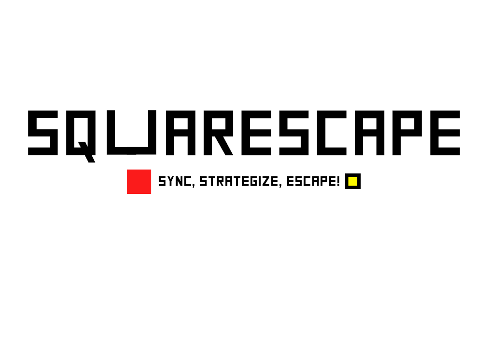
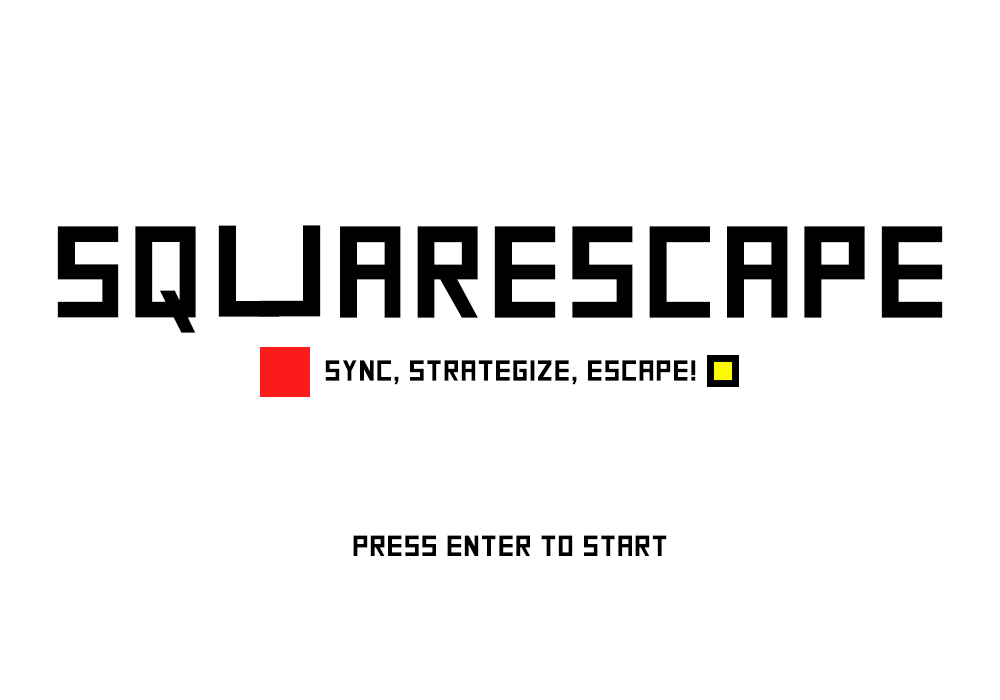
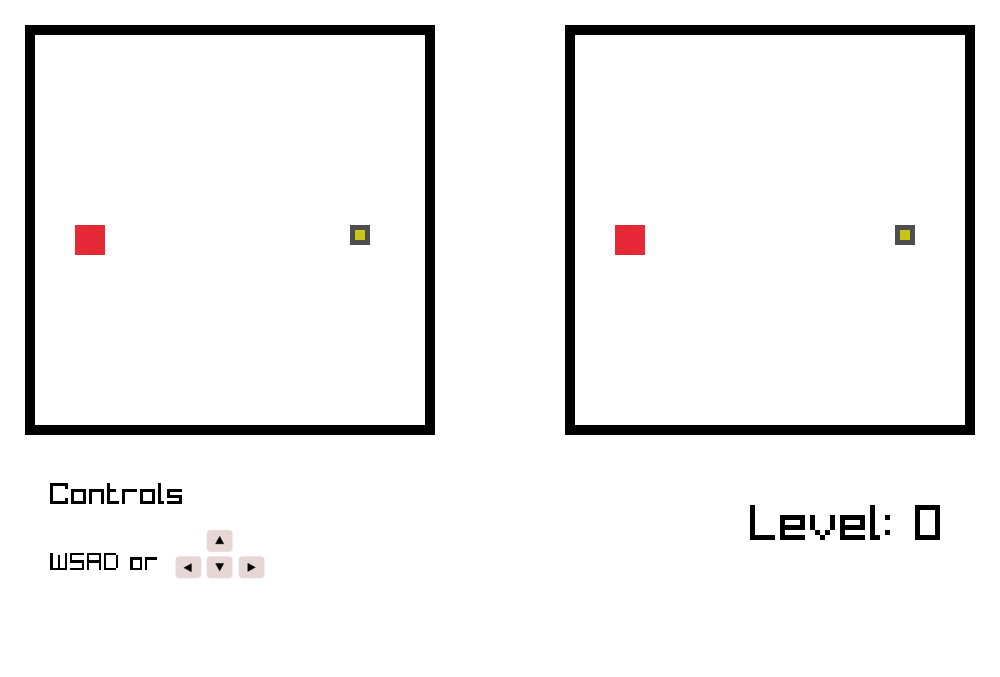
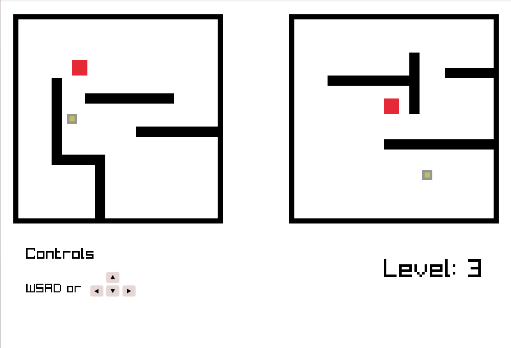
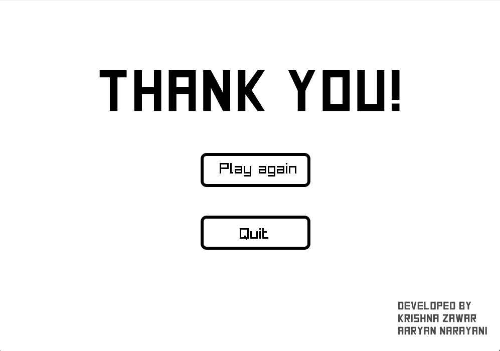

# Squarescape
Sync, Strategize, Escape!

Squarescape is a 2D puzzle game, where two friends are stuck in some connected rooms where each move affects both of them. Dodge obstacles, synchronise your moves, and reach the friends to the escape square to progress to the next level!

        

## Features

- **Dual Maze Challenge:** Navigate two mazes simultaneously using synchronized controls.
- **Obstacle Dodging:** Dodge obstacles to reach the escape square.
- **Progressive Difficulty:** Each level presents new challenges and obstacles to overcome.
- **Strategy Gameplay:** Test your coordination and strategy in this puzzle game.

## How to Play

### Option 1: Download from Website

Visit  [SQUARESCAPE.itch.io](https://krishna-zawar.itch.io/squarescape:target="_blank")  to download Squarescape and start playing immediately!

### Option 2: Clone the Repository

1. Clone or download the repository.
2. Open the game in your preferred environment.
3. Use the W, A, S, and D keys to navigate both mazes simultaneously.
4. Reach the escape square in both mazes to progress to the next level.

## Screenshots

        
        
    
    

## Contributing

Contributions are welcome! If you'd like to contribute to Squarescape, please follow these steps:

1. Fork the repository.
2. Create your feature branch (`git checkout -b feature/YourFeature`).
3. Commit your changes (`git commit -am 'Add some feature'`).
4. Push to the branch (`git push origin feature/YourFeature`).
5. Create a new Pull Request.

